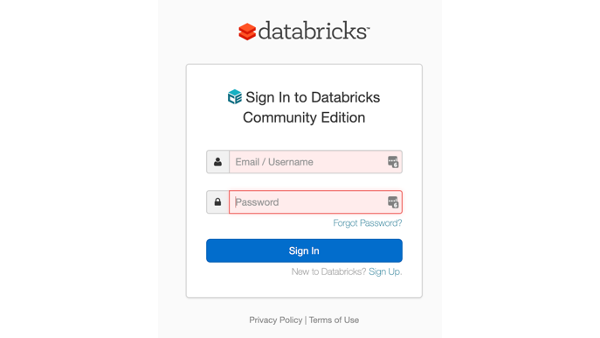
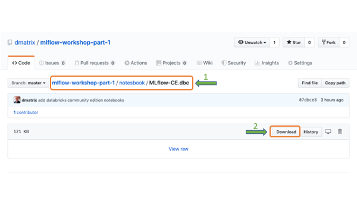

 Managing the Complete Machine Learning Lifecycle with MLflow
=============================================================

Part 1 of 3
-----------
Other parts:
- [Part 2](https://github.com/dmatrix/mlflow-workshop-part-2)
- [Part 3](https://github.com/dmatrix/mlflow-workshop-part-3)

Content for the MLflow Series
-----------------------------
Machine Learning (ML) development brings many new complexities beyond the traditional software development lifecycle. Unlike in traditional software development, ML developers want to try multiple algorithms, tools and parameters to get the best results, and they need to track this information to reproduce work. In addition, developers need to use many distinct systems to productionize models.

To solve these challenges, [MLflow](https://mlflow.org), an open source project, simplifies the entire ML lifecycle. MLflow introduces simple abstractions to package reproducible projects, track results, 
encapsulate models that can be used with many existing tools, and central respositry to share models,
accelerating the ML lifecycle for organizations of any size.

Goal and Objective
------------------
Aimed at beginner or intermediate level, this three-part series aims to educate data scientists or ML developer in how you 
leverage MLflow as a platform to track experiments, package projects to reproduce runs, use model flavors to deploy in diverse environments, and manage models in a central respository for sharing.

What you will learn
-------------------
Understand the four main components of open source MLflow——MLflow Tracking, MLflow Projects, MLflow Models, and Model Registry—and how each compopnent helps address challenges of the ML lifecycle.
 * How to use [MLflow Tracking](https://mlflow.org/docs/latest/tracking.html) to record and query experiments: code, data, config, and results.
 * How to use [MLflow Projects](https://mlflow.org/docs/latest/projects.html) packaging format to reproduce runs
 * How to use [MLflow Models](https://mlflow.org/docs/latest/models.html) general format to send models to diverse deployment tools.
 * How to use [Model Registry](https://mlflow.org/docs/latest/model-registry.html) for collaborative model lifecycle management
 * How to use [MLflow UI](https://mlflow.org/docs/latest/tracking.html#tracking-ui) to visually compare and contrast experimental runs with different tuning parameters and evaluate metrics


Instructor
-----------

- [Jules S. Damji](https://www.linkedin.com/in/dmatrix/) [@2twitme](https://twitter.com/2twitme) 
---


About the MLflow workshop part 1
--------------------------------

In this part 1, we will cover:
 * Concepts and motivation behind MLflow
 * Learn how to use Databricks Community Edition (DCE)
 * Tour of the the MLflow API Documentation
 * Introduce MLflow Python Fluent Tracking APIs
 * Walk and work through a three machine learning models using MLflow APIs in the DCE
 * Use the MLflow UI as part of DCE to compare experiment metrics, parameters, and runs

Prerequisites
-------------
* Before the session, please pre-register for [Databricks Community Edition](https://databricks.com/try-databricks)
* Knowledge of Python 3 and programming in general
* Preferably a UNIX-based, fully-charged laptop with 8-16 GB, with a Chrome or Firefox browser
* Familiarity with GitHub, git, and an account on Github
* Some knowledge of Machine Learning concepts, libraries, and frameworks 
     * scikit-learn
     * pandas and Numpy
     * matplotlib
* [**optional for part-1**] PyCharm/IntelliJ or choice of syntax-based Python editor
* [**optional for part-1**] pip/pip3 or conda and Python 3 installed
* Loads of virtual laughter, curiosity, and a sense of humor ... :-)

Obtaining the Tutorial Material
--------------------------------

Familiarity with **git** is important so that you can get all the material easily during the tutorial and
workshop as well as continue to work in your free time, after the session is over.

``` git clone git@github.com:dmatrix/mlflow-workshop-part-1.git or git clone https://github.com/dmatrix/mlflow-workshop-part-1.git```

Documentation Resources
-----------------------

This tutorial will refer to documentation: 

1. [MLflow](https://mlflow.org/docs/latest/index.html) 
2. [Numpy](https://numpy.org/devdocs/user/quickstart.html)
3. [Pandas](https://pandas.pydata.org/pandas-docs/stable/reference/index.html)
4. [Scikit-Learn](https://scikit-learn.org/stable/index.html)
5. [Keras](https://keras.io/optimizers/)
6. [TensorFlow](https://tensorflow.org)
7. [Matplotlib](https://matplotlib.org/3.2.0/tutorials/introductory/pyplot.html)

How to get started
-------------------
We will walk through this during the session, but please sign up for [Databrick Community Edition](https://databricks.com/try-databricks) before the session :

1. ``` git clone git@github.com:dmatrix/mlflow-workshop-part-1.git ```
2. [Login](https://community.cloud.databricks.com/login.html) into the Datarbicks Community Edition]



3. Create a ML Runtime 6.5 Cluster


4. In the brower: 
  * (1) Go the GitHub **notebooks** subdirectory
  * (2) Download **MLFlow-CE.dbc** file on your laptop



5. Import the **MLFlow-CE.dbc** file into the Databricks Community Edition


Let's go!

Cheers,

Jules
