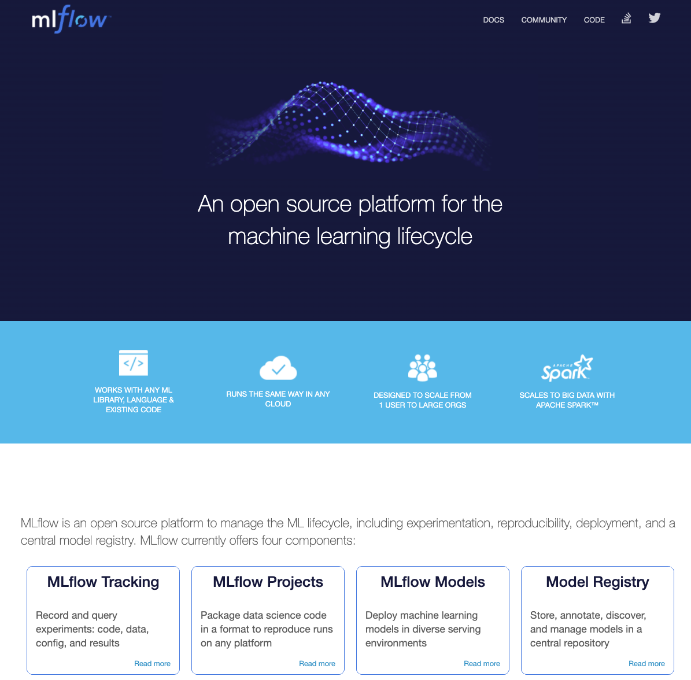

 Managing the Complete Machine Learning Lifecycle with MLflow
===========================================================

Part 1 of 4
-----------
Other parts:
- [Part 2]()
- [Part 3]()
- [Part 4]()

Content for the MLflow Series
-----------------------------
ML development brings many new complexities beyond the traditional software development lifecycle. Unlike in traditional software development, ML developers want to try multiple algorithms, tools and parameters to get the best results, and they need to track this information to reproduce work. In addition, developers need to use many distinct systems to productionize models.

To solve these challenges, [MLflow](https://mlflow.org), an open source project, simplifies the entire ML lifecycle. MLflow introduces simple abstractions to package reproducible projects, track results, 
and encapsulate models that can be used with many existing tools, and central respositry to share models,
accelerating the ML lifecycle for organizations of any size.

What you will learn
-------------------
Understand the four main components of open source MLflow (MLflow Tracking, MLflow Projects, MLflow Models, and MLfow Registry) and how each help address challenges of the ML lifecycle.
 * How to use [MLflow Tracking](https://mlflow.org/docs/latest/tracking.html) to record and query experiments: code, data, config, and results.
 * How to use [MLflow Projects](https://mlflow.org/docs/latest/projects.html) packaging format to reproduce runs
 * How to use [MLflow Models](https://mlflow.org/docs/latest/models.html) general format to send models to diverse deployment tools.
 * How to use [Model Registry](https://mlflow.org/docs/latest/model-registry.html) for collaborative model lifecycle management
 * How to use [MLflow UI](https://mlflow.org/docs/latest/tracking.html#tracking-ui) to visually compare and contrast experimental runs with different tuning parameters and evaluate metrics

Instructor
-----------

- [Jules S. Damji](https://www.linkedin.com/in/dmatrix/) [@2twitme](https://twitter.com/2twitme) 
---

About the MLflow workshop part 1
--------------------------------

In this part 1, we will cover:
 * Concepts and motivation behind MLflow
 * Familirize with the API Documentation
 * Learn how to use Databricks Community Edition Notebook
 * Introduce MLflow Tracking
 * How to use MLflow Tracking APIs 
 * Use the MLflow UI to compare metrics, runs
 * How to use Databricks Community Edition
 * Work through couple of models using Databricks Community Edition

Prerequisites
-------------
This workshop assumes familiarity with the basics of:
* Pre-register for [Databricks Community Edition](https://databricks.com/try-databricks)
* Knowledge of Python 3 and programming in general
* Preferably a UNIX-based, fully-charged laptop with 8-16 GB, with a Chrome or Firefox browser
* Familiarity with GitHub, git, and an account on Github
* Some knowledge of Machine Learning concepts, libraries, and frameworks 
     * scikit-Learn
     * pandas and Numpy
     * matplotlib
* [optional for part-1] PyCharm/IntelliJ or choice of syntax-based Python editor
* [optional for part-1] pip/pip3 or conda and Python 3 installed
* Loads of laughter, curiosity, and a sense of humor ... :-)

Obtaining the Tutorial Material
--------------------------------

Familiar with git is important so that you can get all the material easily and work in it 
in your free time, after the session is over 

Documentation Resources
-----------------------

This tutorial will require recent refering to documentation: 

1. [MLflow](https://mlflow.org/docs/latest/index.html) 
2. [Numpy](https://numpy.org/devdocs/user/quickstart.html)
3. [Pandas](https://pandas.pydata.org/pandas-docs/stable/reference/index.html)
4. [Scikit-Learn](https://scikit-learn.org/stable/index.html)
5. [Keras](https://keras.io/optimizers/)
6. [TensorFlow](https://tensorflow.org)
7. [Matplotlib](https://matplotlib.org/3.2.0/tutorials/introductory/pyplot.html)

Let's go!

Cheers,
Jules
